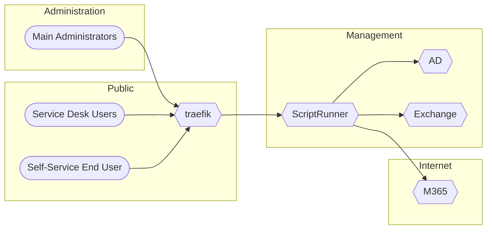

# Usage of ScripRunner behind traefik ReverseProxy on Docker Swarm mode

- [Usage of ScripRunner behind traefik ReverseProxy on Docker Swarm mode](#usage-of-scriprunner-behind-traefik-reverseproxy-on-docker-swarm-mode)
  - [about](#about)
  - [requirements](#requirements)
- [ScriptRunner server (*sr-server.domain.tld*)](#scriptrunner-server-sr-serverdomaintld)
  - [create ssl certificates for sr-server](#create-ssl-certificates-for-sr-server)
  - [set SPN for sr-server to host for use with reverse proxy](#set-spn-for-sr-server-to-host-for-use-with-reverse-proxy)
  - [edit baseUri](#edit-baseuri)
  - [renew SR-backend certificate to use the one from reverse proxy *host.domain.tld*:](#renew-sr-backend-certificate-to-use-the-one-from-reverse-proxy-hostdomaintld)
  - [import cert:](#import-cert)
  - [check Thumbprint of used certificate:](#check-thumbprint-of-used-certificate)
  - [hosts file entry for local use](#hosts-file-entry-for-local-use)
- [traefik on docker swarm mode (*host.domain.tld*)](#traefik-on-docker-swarm-mode-hostdomaintld)
  - [DNS](#dns)
  - [docker swarm mode traefik directory structure:](#docker-swarm-mode-traefik-directory-structure)
  - [deploy stack](#deploy-stack)

## about

this is an excerpt of a working configuration to use the ScriptRunner web-portals "portal", "admin" and "reports" via traefik reverse proxy running on docker swarm mode cluster.




the use of an reverse proxy has the following advantages: 

- no direct exposure of the SR [ScriptRunner] services and resources

  users (and potential attackers) may have access to the webinterfaces from anywhere, but only the SR-server in the backend has access to the scripting resources.

- central ssl encryption

  the SR-server can use a self signed certificate if the the and the reverse proxy [RP] handles the signed certificates.

- combine different websites into a single URL space
  
  instead of calling the portal direct from the scriptRunner server via `https://sr-server.domain.tld/scriptrunner/portal/` (which should be installed in a non-public network  segment), it can than be called via `https://host.domain.tld/scriptrunner/portal/` from a public accessible network segment. Other services can also use the same url space, f.i.: `https://host.domain.tld/jenkins/`

- added security features like ip-white/black-listing, authentication

  ability to control access to admin portal to certain ip-addresses / -ranges (will likely stop working with the new webportal, since there is no separation anymore)

## requirements

you have to allow the TCP ports 443, 8091 and 8092 to be used from `host.domain.tld` to `sr-server.domain.tld`.

there is also configured, that the admin portal `https://host.domain.tld/scriptrunner/admin/` is only allowed to be accessed form a whitelisted ip range.

# ScriptRunner server (*sr-server.domain.tld*)

## create ssl certificates for sr-server

https://support.scriptrunner.com/articles/#!server/create-certificate

## set SPN for sr-server to host for use with reverse proxy

https://support.scriptrunner.com/articles/#!server/http-to-https/a/h2__565733207

```
setspn -s http/host.domain.tld sr-server
```

## edit baseUri 

from `https://host.domain.tld` to `sr-server.domain.tld`

- C:\Program Files\ScriptRunner\WebApps\AdminApp\uri.js
- C:\Program Files\ScriptRunner\WebApps\Portal\app.json

## renew SR-backend certificate to use the one from reverse proxy *host.domain.tld*:

- dyn.yml `/etc/certs/domain.tld.crt`

## import cert:

https://support.scriptrunner.com/articles/#!server/install-ssl

https://support.scriptrunner.com/articles/#!server/renew-certificate

```
Set-AsrURI -SSLCertThumbprint THUMBPRINT -SSLReplaceExisting -SSLEnable -Restart
```

## check Thumbprint of used certificate:

`Test-AsrUri -Verbose`

```
AUSFÜHRLICH: Checking port 8091 certificate binding...
AUSFÜHRLICH: netsh>
AUSFÜHRLICH: SSL-Zertifikatbindungen:
AUSFÜHRLICH: -------------------------
AUSFÜHRLICH:
AUSFÜHRLICH:
AUSFÜHRLICH:
AUSFÜHRLICH:     IP:Port                      : 0.0.0.0:8091                                                            
AUSFÜHRLICH:     Zertifikathash              : af459df0ed47a6fg4b8f6a20caf2488d3bb6e1bb
...
AUSFÜHRLICH: Ignoring certificate errors...
AUSFÜHRLICH: GET https://localhost:8091/ScriptRunner with 0-byte payload
AUSFÜHRLICH: received 5564-byte response of content type application/json; odata.metadata=minimal; odata.streaming=true
```

## hosts file entry for local use

```
127.0.0.1 host.domain.tld
```

# traefik on docker swarm mode (*host.domain.tld*)

## DNS

have host (A) entries for all node ips of the swarm to **host.domain.tld**

## docker swarm mode traefik directory structure:

```
# tree /mnt/gv0/stack-traefik/
/mnt/gv0/stack-traefik/
├── configuration
│   └── swarmX
│       └── traefik
│           ├── dyn.yml
│           └── traefik.yml
├── data
│   └── swarmX
│       └── traefik
│           ├── certs
│           │   ├── domain.tld.crt
│           │   └── domain.tld.key
│           └── logs
│               ├── access.log
│               └── traefik.log
├── docker-compose.yml
└── swarmX.yml
```

## deploy stack

```
docker stack deploy -c docker-compose.yml -c swarmX.yml traefik
```